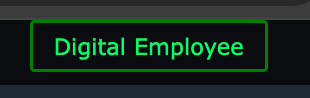

# Digital-Employee

## Digital Employee Button Integration

<div align="center">
  
  <p><i><b>Digital Employee:</b> Seamlessly blending data analysis, SQL learning, and professional communication.</i></p>
</div>

---

This project provides a simple way to integrate a "Digital Employee" button into your web application. The button is styled with a green theme and opens a specific agent URL in a new tab when clicked.


## Implementation Guide

Follow these steps to add the Digital Employee button to your page.

### Step 1: Add the HTML Button

Add the following HTML code where you want the button to appear. The button is styled to be positioned absolutely at the top of its container.

```html
<button id="digitalEmployeeBtn" 
    style="color:green; 
           border-color: green; 
           border: 2px solid green; 
           position: absolute; 
           right: 13%; 
           top: 0px;">
    Digital Employee
</button>
```

### Step 2: Add the Click Handler (JavaScript)

Include the following script to handle the button click. This will open the Snowflake Agent URL in a new browser tab.

```javascript
<script>
document.getElementById("digitalEmployeeBtn").onclick = function () {
    window.open(
        "http://SnowflakeAgent.us-east-1.elasticbeanstalk.com",
        "_blank"
    );
};
</script>
```

## Configuration

| Element | Description |
| :--- | :--- |
| **Button ID** | `digitalEmployeeBtn` |
| **Agent URL** | `http://SnowflakeAgent.us-east-1.elasticbeanstalk.com` |
| **Styling** | Green borders and text, absolute positioning |

---

# 📘 Digital Employee — Implementation Report

## Project Overview

This project implements a **Digital Employee**:

* Assist users with **business data analysis**
* Support **learning SQL via natural language**
* Provide **context-aware follow-up questions**
* Generate **professional reply drafts** (LinkedIn-style)
* Remain **independent of backend LLM choice** (Gemini / Snowflake)

---

## Requirements Summary

Expectations:

1. Hard-coded starter questions for users
2. Context-aware follow-up question generation
3. LinkedIn-style response suggestions
4. Model-agnostic design (Snowflake / Gemini)

---

## Implementation Details & Status

### 1️⃣ Hard-Coded Starter Questions

**Status: ✅ Completed**

**What was asked:**

* Provide fixed starter questions to guide users
* Should not depend on backend model
* Should auto-trigger behavior

**What was implemented:**

* Intent-based starter buttons:

  * 📊 Analyze data
  * ⚙️ Automate work
  * 📅 Prepare meetings
  * 📘 Learn SQL
* Buttons **auto-submit** on click
* No manual typing required

**Result:**
Users can start interacting immediately without knowing SQL.

---

### 2️⃣ Follow-Up Question Generation

**Status: ✅ Completed**

**What was asked:**

* System should suggest next relevant questions
* Must be dynamic (not hard-coded)
* Must be context-aware

**What was implemented:**

* AI-generated follow-up questions using LLM
* Generated **only for DATA intent**
* Always shown even if SQL execution fails
* Includes enterprise-safe fallback to avoid empty UI

**Example:**

* “Can you break this down further?”
* “Can you compare this with last month?”
* “What trends should I look at next?”

---

### 3️⃣ LinkedIn-Style Response Suggestions

**Status: ✅ Completed**

**What was asked:**

* Like LinkedIn Smart Reply
* User clicks a prepared response instead of typing
* Context-aware and professional

**What was implemented:**

* Explicit **REPLY intent classification**
* Reply drafts generated only for conversational inputs
* Replies are framed as **drafts to send externally**
* Clickable, one-line, professional responses

**Example Flow:**
User pastes:

> “Thank you for helping me with this”

System suggests:

* “You’re welcome.”
* “Happy to help.”
* “Anytime.”

> The system does **not reply to itself** — it helps the user draft a response.

---

### 4️⃣ Intent Classification (Key Architectural Piece)

**Status: ✅ Completed**

**Purpose:**
To avoid incorrect behavior such as generating SQL for conversational messages.

**Implemented Intents:**

* `DATA` → analytics, SQL, reporting
* `REPLY` → acknowledgements, responses, drafting replies

**Behavior Contract:**

| Intent | SQL | Follow-ups | Reply Drafts |
| ------ | --- | ---------- | ------------ |
| DATA   | ✅   | ✅          | ❌            |
| REPLY  | ❌   | ❌          | ✅            |

This ensures **predictable and explainable behavior**.

---

### 5️⃣ NLP → SQL Capability

**Status: ✅ Implemented (Execution Infra Dependent)**

**What was implemented:**

* Natural language → SQL generation via Gemini
* SQL execution attempted via Snowflake
* Graceful handling if execution fails

**Important Note:**
SQL execution depends on Snowflake infrastructure (tables, roles, data).
This milestone focused on **Digital Employee behavior**, not data readiness.

---

### 6️⃣ Model-Agnostic Design

**Status: ✅ Completed**

**What was asked:**

* Solution should work irrespective of backend model

**What was implemented:**

* Gemini used for:

  * Intent classification
  * Follow-up generation
  * Reply draft generation
* Snowflake used only for optional SQL execution
* No Snowflake Cortex dependency

**Result:**
The behavior layer is fully portable to other LLMs.

---

### 7️⃣ UX & Interaction Design

**Status: ✅ Completed**

**Key UX decisions:**

* Button click → auto-submit
* Ask button → manual submit for typed input
* No surprise auto-execution
* No ambiguous system messages
* Clear separation of modes (DATA vs REPLY)

---

## Final Status Summary

| Requirement              | Status |
| ------------------------ | ------ |
| Hard-coded starters      | ✅ Done |
| Follow-up questions      | ✅ Done |
| LinkedIn-style replies   | ✅ Done |
| Intent-aware behavior    | ✅ Done |

---

